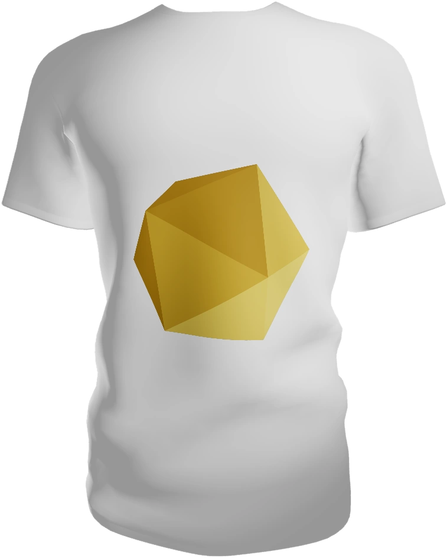

# react-3d-shirt

A customizable interactive 3d t-shirt. You can try it out at
[here](https://zebreus.github.io/react-3d-shirt/?story=shirt--with-motif).



## Example

```jsx
import { Shirt } from "react-3d-shirt"

...
  <Shirt motif="https://picsum.photos/300/300" color="#ff0000"/>
...
```
